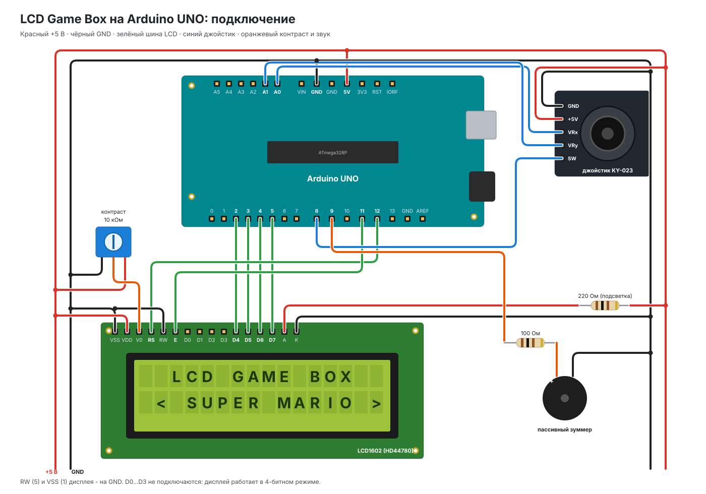
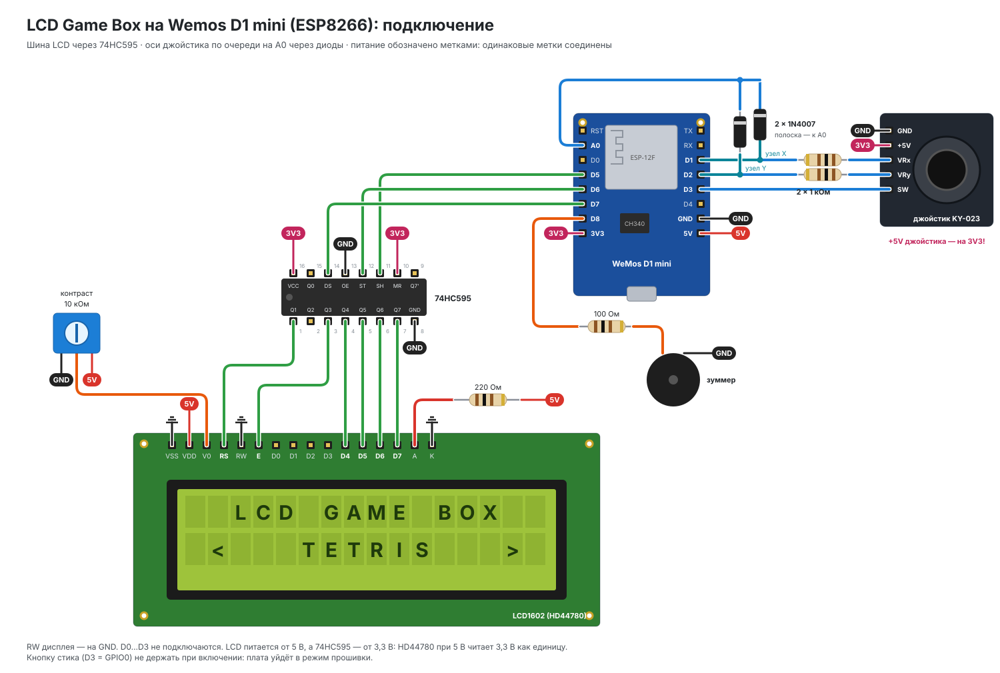

# LCD Game Box

Игровая приставка из того, что обычно остаётся от стартового набора Arduino: дисплея
LCD1602 (16×2), аналогового джойстика и пассивного зуммера. Работает на **Arduino UNO**
или на **Wemos D1 mini (ESP8266)**. На ESP8266 доступен полный список игр и обновление
прошивки по Wi-Fi прямо с GitHub. При включении открывается меню, в нём выбирается игра.

## Игры

| Игра | Кратко | UNO |
|---|---|---|
| **Super Mario** | 9 уровней в двух мирах: гумбы, купы с панцирями, пираньи, платформы, пружины, гриб, лава и Боузер | `uno` |
| **Tetris** | стакан 10×16 точек, 7-bag, ускорение каждые 10 линий | `uno`, `uno_arcade` |
| **Snake** | поле 20×16 точек, режимы «стены» и «сквозь края» | `uno`, `uno_arcade` |
| **Dino Run** | раннер с плавной прокруткой по точкам: группы из 1–3 кактусов, птеродактили на трёх высотах | `uno`, `uno_arcade` |
| **Arkanoid** | 4 раскладки кирпичей по кругу, угол отскока зависит от места удара о ракетку | `uno_arcade` |
| **Flappy Bird** | птица между трубами, физика и размеры проёма — как в оригинале | `uno_arcade` |
| **Space Shooter** | 4 дорожки, три вида врагов; каждая 4-я волна — босс: следит за дорожкой, бьёт зарядами, таранит | `uno_arcade` |

На ESP8266 в прошивке все игры. В UNO (32 КБ Flash) все сразу не помещаются, поэтому для неё
два набора — выбирается окружением сборки (см. ниже).

## Железо

### Arduino UNO



| Деталь | Подключение |
|---|---|
| LCD1602 (HD44780, параллельный) | VSS→GND, VDD→5V, RS→D12, RW→GND, E→D11, D4→D2, D5→D3, D6→D4, D7→D5, K→GND |
| | V0 → средний вывод потенциометра 10 кОм (крайние на 5V и GND) — контраст |
| | A → 5V через 220 Ом (если на плате дисплея нет своего резистора) |
| Джойстик (KY-023 и аналоги) | +5V→5V, GND→GND, VRx→A0, VRy→A1, SW→D8 |
| Пассивный зуммер | D9 → 100 Ом → зуммер → GND |

### Wemos D1 mini (ESP8266)

У ESP8266 меньше выводов и всего один аналоговый вход, поэтому:
- **LCD подключается через сдвиговый регистр 74HC595** (3 провода вместо 6);
- **оси джойстика читаются через A0 по очереди**: каждая ось подключена к A0 через свой
  диод, а вывод D1/D2 в LOW «отключает» ненужную ось. Диод сдвигает показания примерно
  на 0,3–0,5 В, но джойстик используется как 4 направления, а центр измеряется при
  включении, так что пороги это учитывают.



| Деталь | Подключение |
|---|---|
| 74HC595 | VCC(16), MR(10) → 3V3; GND(8), OE(13) → GND; DS(14) → D7; SH_CP(11) → D5; ST_CP(12) → D6 |
| LCD1602 | Q1 → RS, Q3 → E, Q4…Q7 → D4…D7; VDD → 5V, RW → GND; V0, A, K — как для UNO |
| Джойстик | +5V → **3V3**, GND → GND, SW → D3 |
| | VRx → 1 кОм → узел X; узел X → D1; узел X → анод диода 1N4007, катод → A0 |
| | VRy → 1 кОм → узел Y; узел Y → D2; узел Y → анод диода 1N4007, катод → A0 |
| Пассивный зуммер | D8 → 100 Ом → зуммер → GND |

LCD питается от 5 В, а управляется 3,3-вольтовыми выходами 74HC595: HD44780 при 5 В
считает единицей всё выше ~2,2 В, так что согласователь уровней не нужен. RW на земле,
поэтому дисплей никогда не выдаёт 5 В обратно на регистр.

Пины и ориентация джойстика настраиваются в [`src/core/Config.h`](src/core/Config.h).

### Настройка джойстика

Пункт меню **JOYSTICK SETUP**: в верхней строке — сырые значения осей и нажатые направления
(`L R U D C`), в нижней — настройка. Нажатие стика переключает настройку, ←/→ меняют значение,
удержание стика сохраняет в EEPROM и выходит в меню.

- **SENSITIVITY 1…10** — насколько сильно нужно наклонить стик: 1 — почти до упора, 10 — чуть-чуть.
  Если направления срабатывают сами, уменьшите; если не срабатывают — увеличьте.
- **DEBOUNCE 10…100 мс** — защита от дребезга: сколько состояние кнопки или наклона должно
  продержаться, чтобы засчитаться. Если бывают двойные нажатия — увеличьте.

### Схемы и симулятор

Картинки схем генерируются скриптами из [`docs/wiring/`](docs/wiring): поправить `uno.py` или
`d1_mini.py` и выполнить `uv run --with cairosvg python docs/wiring/uno.py`.

Версию для UNO можно запустить без железа в симуляторе [Wokwi](https://wokwi.com): в репозитории
есть [`diagram.json`](diagram.json) и [`wokwi.toml`](wokwi.toml). В VS Code поставить расширение
Wokwi Simulator, собрать `pio run -e uno` и выбрать «Wokwi: Start Simulator».
ESP8266 в Wokwi не поддерживается.

## Сборка и прошивка

Нужен [PlatformIO](https://platformio.org/).

```sh
pio run -e uno -t upload            # Arduino UNO: Mario, Tetris, Snake, Dino Run
pio run -e uno_arcade -t upload     # Arduino UNO: все аркады без Mario
pio run -e d1_mini -t upload        # Wemos D1 mini по USB
pio run -e d1_mini_ota -t upload    # Wemos D1 mini по Wi-Fi (плата уже в сети)
```

## Wi-Fi и обновления (ESP8266)

- **Подключение к сети:** меню → SETTINGS → WI-FI SETUP. Плата поднимает точку доступа
  `ESP Config`; подключитесь к ней с телефона, откройте `192.168.1.1` и введите имя и пароль
  сети. ESP8266 запоминает сеть и дальше подключается сам.
- **Обновление:** SETTINGS → CHECK UPDATE. Плата читает [`project.json`](project.json) из этого
  репозитория и, если там другая версия, скачивает прошивку из последнего GitHub Release.
- **Выпуск версии:** поднять `GAMEBOX_VERSION` в `src/core/Config.h` и `version` в
  `project.json`, закоммитить и запушить тег `vX.Y.Z`. GitHub Actions проверит, что версии
  совпадают, соберёт прошивки для обеих плат и выложит их в Release.

## Управление

- **Меню:** ←/→ — выбор игры (удержание — листать), нажатие стика — запуск.
- **Титульный экран любой игры:** нажатие — старт, удержание стика ~1 с — выход в меню.
  Там же показан рекорд игры (хранится в EEPROM).

| Игра | Управление |
|---|---|
| Super Mario | ←/→ — ходьба, ↑ или нажатие — прыжок |
| Tetris | ←/→ — сдвиг, ↓ — быстрее вниз, ↑ или нажатие — поворот |
| Snake | стик — поворот, удержание нажатия — ускорение; на титульном экране ←/→ — режим (стены / сквозь края) |
| Dino Run | ↑ или нажатие — прыжок (и из приседа), ↓ — пригнуться, ↓ в прыжке — быстрее вниз. Птеродактиль: низкий — перепрыгнуть, средний — пригнуться, высокий — не прыгать |
| Arkanoid | ←/→ — ракетка, нажатие или ↑ — запуск мяча |
| Flappy Bird | ↑ или нажатие — взмах |
| Space Shooter | ↑/↓ — дорожка, ←/→ — вперёд/назад, нажатие — выстрел (удержание — автоогонь). Заряды босса (+) не сбиваются — от них уклоняться; замигал — сейчас протаранит свои две дорожки |


## Устройство проекта

```
src/
  main.cpp             setup()/loop(): опрос ядра и лаунчера
  core/                общее для всех игр
    Config.h           пины и настройки железа для UNO и ESP8266, версия прошивки
    Display.*          LCD: вывод с буфером изменений, пользовательские символы
    Input.*            джойстик: калибровка, гистерезис, дребезг и автоповтор (EncButton)
    Network.*          Wi-Fi и ArduinoOTA (только ESP8266)
    Sound.*            мелодии из PROGMEM без блокировки
    Storage.*          рекорды в EEPROM (слот на игру)
    Phase.h            шаги конечного автомата по millis() вместо delay()
    PixelCanvas.*      пиксельный режим: до 8 знакомест как холст из точек (20×16 или 40×8)
    GameScreens.*      общие титульный экран и экран итога с рекордом
    Game.h             интерфейс игры
    GameRegistry.h     описание списка игр
    Launcher.*         меню и запуск игр
  games/
    Registry.cpp       список игр и общая область памяти для них
    mario/             Super Mario: логика, уровни, спрайты, звуки
    tetris/ snake/ dino/ arkanoid/ flappy/ shooter/
  system/
    JoystickSetup.*    настройка джойстика: чувствительность, дребезг, живые показания
    SettingsApp.*      Wi-Fi и обновление прошивки (только ESP8266)
project.json           манифест обновлений для ESP8266
.github/workflows/     сборка всех плат на каждый пуш, выпуск прошивок по тегу
tools/
  check_levels.py      проверка проходимости уровней Mario
```

Основные правила:

- **Ничего не блокирует.** В коде нет `delay()`: каждая игра — конечный автомат, время
  отсчитывается через `millis()`.
- **Память делится между играми.** Игры создаются в общей области памяти `gameArena`,
  её размер равен размеру самой большой игры. Состояние игры хранится в полях её класса,
  поэтому RAM занята только пока игра запущена. Это важно при 2 КБ RAM у UNO.
- **Символы дисплея принадлежат игре.** У HD44780 всего 8 пользовательских символов, и все
  они отданы запущенной игре. Mario, например, при старте уровня загружает только те
  спрайты, которые в нём встречаются.

### Как добавить игру

1. Создать `src/games/<name>/` с классом, унаследованным от `Game` ([`core/Game.h`](src/core/Game.h)):
   `begin()` вызывается при запуске, `update()` — на каждом проходе `loop()`. Чтобы вернуться
   в меню, игра вызывает `requestExit()`.
2. В [`games/Registry.cpp`](src/games/Registry.cpp) завести макрос `WITH_<ИГРА>` и решить,
   в какие наборы UNO она входит; подключить заголовок, добавить строку в `GAMES` и `sizeof`
   класса в `GAME_ARENA_SIZE`. Для титульного экрана и итога взять `TitleScreen` и
   `ResultScreen` из [`core/GameScreens.h`](src/core/GameScreens.h), для точечной графики —
   `PixelCanvas`.
3. Если игра хранит рекорд, взять свободный слот `Storage` (слот 0 занят Mario).

### Уровни Mario

Уровни записаны строками в [`src/games/mario/MarioLevels.h`](src/games/mario/MarioLevels.h),
легенда символов — там же. После правки запустите проверку:

```sh
python3 tools/check_levels.py
```

Скрипт повторяет правила движения из игры и перебором проверяет, что до флага можно дойти
с учётом платформ, пираний и огненных шаров. Ещё он проверяет, что уровню хватает
7 пользовательских символов, и предупреждает о врагах под кирпичным потолком.

## Библиотеки

- [EncButton](https://github.com/GyverLibs/EncButton) — кнопки: дребезг, удержание, автоповтор;
- [LiquidCrystal](https://github.com/arduino-libraries/LiquidCrystal) (UNO) и
  [LiquidCrystal_74HC595](https://github.com/matmunk/LiquidCrystal_74HC595) (ESP8266) — дисплей;
- [SimplePortal](https://github.com/GyverLibs/SimplePortal) — ввод пароля Wi-Fi;
- [AutoOTA](https://github.com/GyverLibs/AutoOTA) — обновления с GitHub.

## Лицензия

[MIT](LICENSE)
